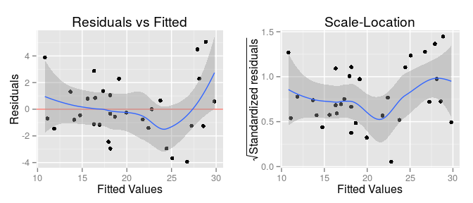
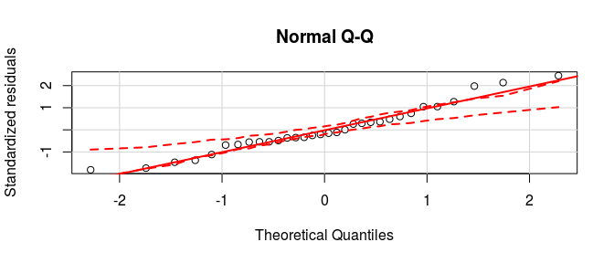
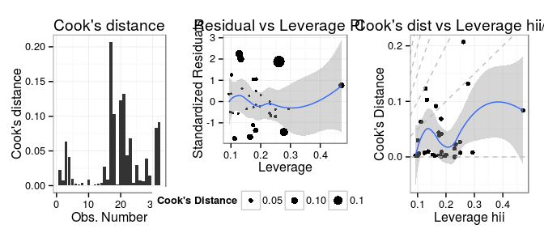
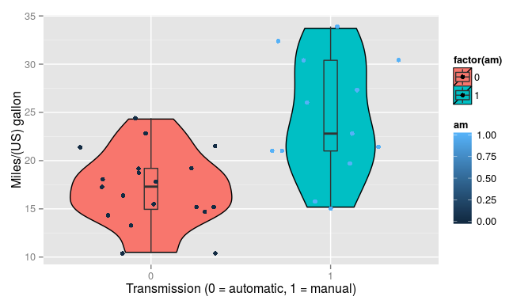
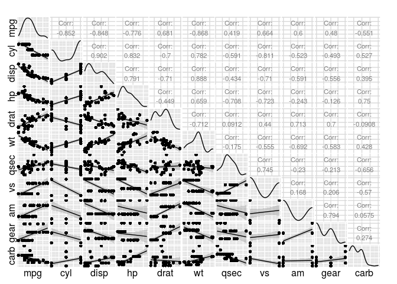

# Regression Models
Maverix13  
October 19, 2015  

## Executive Summary

The report presents an analysis in the relationship automobile transmission and miles per gallon (MPG) as output. The dataset(mtcars) used in the study was extracted from the 1974 Motor Trend US magazine. This report also quantifies the MPG difference between automatic and manual transmission.

To provide the relationship between MPG and transmission, this report present exploratory analysis, model selection and diagnostics. Model selection uses testing hypothesis and regression models to make inference. Multiple models -- ranging from a simple univariate to mulitvariate -- are used and a selection of required variables is presented. Multivariate regression provided better results. 

Finally, a model based on number of cylinders, horse power, weight and transmission is selected. These variables provide the most impact in quantifying the MPG difference between automatic and manual transmission. The report concludes :


* Cars with manual transmission is better than autmoatic transmission. The MPG difference is 1.8.
* MPG decreases with the weight of the car, about 2.5 for every 1000 lb increase.
* MPG decreases on number of cylinders. From 4 to 6 decrease is 3.0 while it is 2.2 for 8.
* Also, MPG decreases 0.032 per unit increase in horse power.

## Analysis

###Exploratory Analysis

The dataset mtcars is loaded for current analysis. A simple linear model of MPG against transmission is presented below.


```
##              Estimate Std. Error   t value     Pr(>|t|)
## (Intercept) 17.147368   1.124603 15.247492 1.133983e-15
## factor(am)1  7.244939   1.764422  4.106127 2.850207e-04
```

Table above shows an intercept estimate 17.15 interpreted as mean MPG for manual transmission and slope of 7.24 interpreted as difference between the means of manual and automatic transmission with a *p-value* of 2.850207e-04 which is significant. Hence, we can reject the **null hypothesis** and further investigate the effect of other variables. Figure 1 shows a graphical depiction of above analysis.

Further, pair analysis of Figure 2 shows the correlation of variables other than am may have effect on MPG. 

###Model Selection

Model selection requires a combination of predictors to best determine overall fuel efficiency. Including all the predictors will result in high standard error. Following steps will evaluate models to make up best formula for prediction.

***Collinearity***

To diagnose collinearity in multiple variables in our model, variance inflation factor(VIF) is used as a diagnostic tool. Since this model contains factor variables, VIF values for factor variables will be very high depending on the number of factor values measured as Degrees of freedom. Hence to provide for comparison, we use GVIF^(1/(2*Df)) (the square root of the VIF/GVIF value as DF=1) which is the proportional change of the standard error and confidence interval of their coefficients due to the level of collinearity.

```
##  factor(cyl)         disp           hp         drat           wt 
##     3.364380     7.769536     5.312210     2.609533     4.881683 
##         qsec   factor(vs)   factor(am) factor(gear) factor(carb) 
##     3.284842     2.843970     3.151269     2.670408     1.862838
```

We notice that disp has unusually high value. Also, referring to Figure 2, we can see that cyl and disp has a correlation of 0.902 signifying that disp is a redundat variable can be dropped from the model.

***Stepwise Selection***

[Reference: http://www.biostat.jhsph.edu/~iruczins/teaching/jf/ch10.pdf, Section: 10.2/10.3]

We start with a model including all the variables. Stepwise model selection uses the Akaike information criterion that implements both forward selection and backward elimination. This ensures that we have included useful variables while omitting ones that do not contribute significantly to predicting mpg.


As shown in Table 1 (Appendix) the stepwise model is based on cyl, hp, wt and am as predictors with R-squared of 86.6%, meaning 86.6% of the variability is captured by this model.

***Model Comparison***

In this section, we compare the models using Nested Likelihood Ratio Test. The models we are using are simple model , stepwise selected model, collinearity model and model containing all the variables.


```r
fit1 <- lm(mpg ~ factor(am), data = mtcars)
fit2 <- lm(mpg ~ factor(cyl) + hp + wt + factor(am), data = mtcars)
fit3 <- lm(mpg ~ factor(cyl) + hp + drat + wt + qsec + factor(vs) + factor(am) + 
             factor(gear) + factor(carb), data = mtcars)
fit4 <- lm(mpg ~ factor(cyl) + disp + hp + drat + wt + qsec + factor(vs) + factor(am) + 
             factor(gear) + factor(carb), data = mtcars)
```

Interpreting the results from Table 2, we see that second model has a p-value which is significant and we can reject the null hypothesis that additional varaibles do not contribute to MPG. While model 3 and 4 have insignificat p value so null hypothesis holds.

Further analysis will be done on model 2 (mpg ~ factor(cyl) + hp + wt + factor(am)). 

Referring to Table 1 (Appendix) the model above shows a R-squared of 0.8659 explaining 86.59% of variation. Also, model has a very low p value and we can confidently reject the null hypothesis.

###Residual and Diagnostics

***Residuals vs Fitted Values***

The graphs in Figure 3 show residuals plotted against fitted values. First graph shows that there are no systematic patterns. Standardized residuals provide more comparable scale (making it a t like statistic). Again there is no systematic pattern visible.

***Normality of Residuals***

Normal Q-Q plot testing the normality of errors by plotting theoretical quantiles by standardized residuals. The graph in Figure 4 shows it is normal and there are no visible tails as well as it does not appear skewed.

***Influence Measures***

The graphs in Figure 5 present the influence of various data points. Based on Cook's distance observation 18 (Fiat 128) is influential. Further analysis (not present in this report) also showed that Fiat128 has high residual as well as an outlier on Normal Q-Q plot.

# Appendix

##Residual and Diagnostics

###Figure 3

 

###Figure 4

 

###Figure 5

 

## Model Selection

### Table 1


```
## 
## Call:
## lm(formula = mpg ~ factor(cyl) + hp + wt + factor(am), data = mtcars)
## 
## Residuals:
##     Min      1Q  Median      3Q     Max 
## -3.9387 -1.2560 -0.4013  1.1253  5.0513 
## 
## Coefficients:
##              Estimate Std. Error t value Pr(>|t|)    
## (Intercept)  33.70832    2.60489  12.940 7.73e-13 ***
## factor(cyl)6 -3.03134    1.40728  -2.154  0.04068 *  
## factor(cyl)8 -2.16368    2.28425  -0.947  0.35225    
## hp           -0.03211    0.01369  -2.345  0.02693 *  
## wt           -2.49683    0.88559  -2.819  0.00908 ** 
## factor(am)1   1.80921    1.39630   1.296  0.20646    
## ---
## Signif. codes:  0 '***' 0.001 '**' 0.01 '*' 0.05 '.' 0.1 ' ' 1
## 
## Residual standard error: 2.41 on 26 degrees of freedom
## Multiple R-squared:  0.8659,	Adjusted R-squared:  0.8401 
## F-statistic: 33.57 on 5 and 26 DF,  p-value: 1.506e-10
```

### Table 2


```
## Analysis of Variance Table
## 
## Model 1: mpg ~ factor(am)
## Model 2: mpg ~ factor(cyl) + hp + wt + factor(am)
## Model 3: mpg ~ factor(cyl) + hp + drat + wt + qsec + factor(vs) + factor(am) + 
##     factor(gear) + factor(carb)
## Model 4: mpg ~ factor(cyl) + disp + hp + drat + wt + qsec + factor(vs) + 
##     factor(am) + factor(gear) + factor(carb)
##   Res.Df    RSS Df Sum of Sq       F    Pr(>F)    
## 1     30 720.90                                   
## 2     26 151.03  4    569.87 17.7489 1.476e-05 ***
## 3     16 130.37 10     20.66  0.2573    0.9822    
## 4     15 120.40  1      9.97  1.2417    0.2827    
## ---
## Signif. codes:  0 '***' 0.001 '**' 0.01 '*' 0.05 '.' 0.1 ' ' 1
```

## Exploratory Analysis

### Figure 1

 

### Figure 2

 

